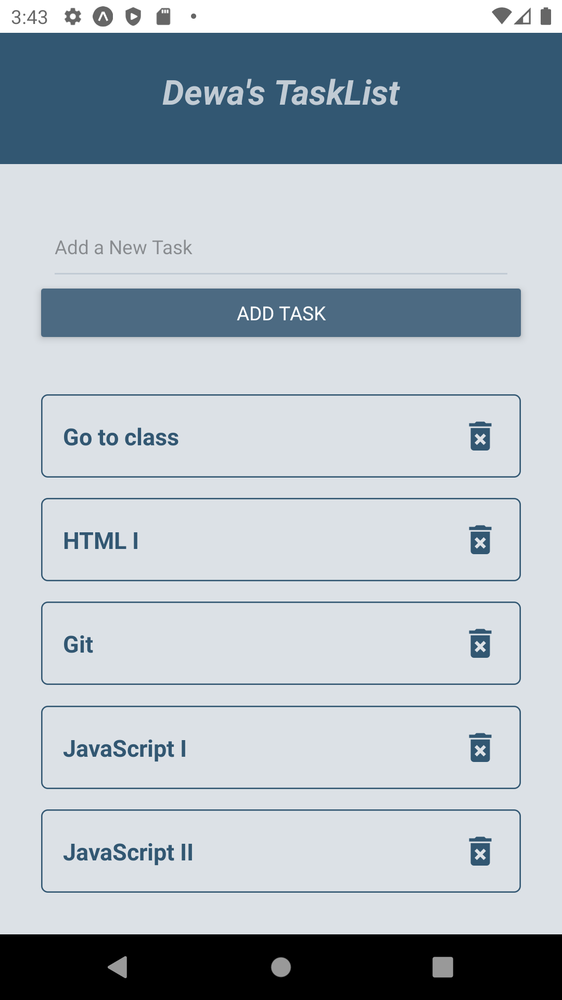
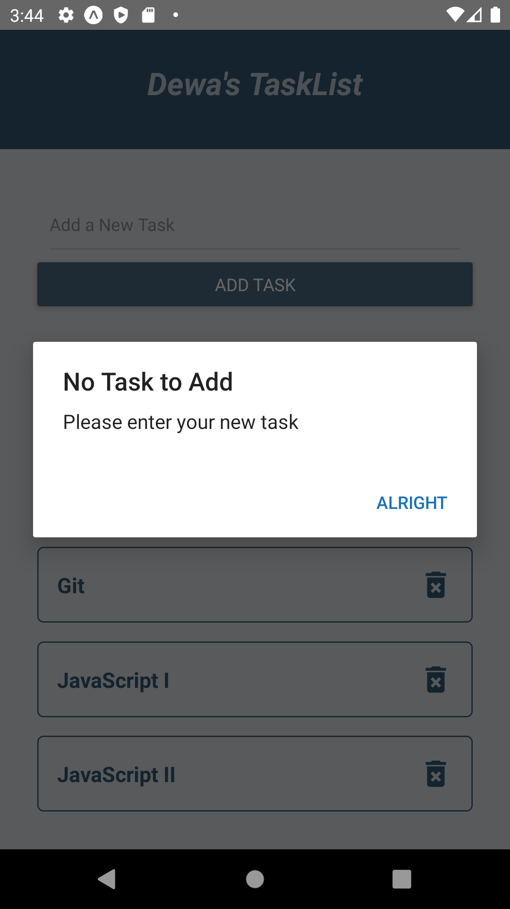

# todo mobile app

A todolist mobile app built with react-native

## Features

* Add tasks
* Delete tasks

## Tools Used

* react-native
* uuid

## Demos

*Home View*

*Alert Displayed when User tries to input an empty task*